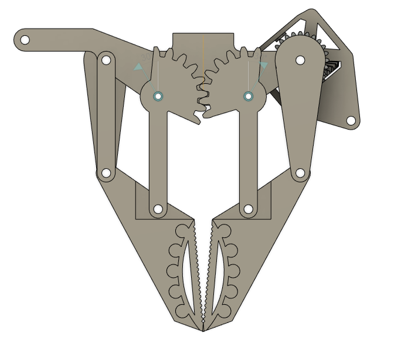

# The Gripper

This folder contains the STL files you will need for the gripper. Some parts are mirrored (A/B parts), and generally you will need one for each pair of fingers.

Suggested material PLA:
* Palm x 1
* DiffBody x 1
* DiffGear x 2
* GearFingerA x 2
* GearFingerB x 2
* PassiveFinger x 2
* DiffFinger x 2
* FingerTipA x 2
* FingerTipB x 2

The finger pads are printed with flexible filament and slide into the finger tips.
* FingerPad x 4

In addition, you will need metal shafts to act as axles.  I have used trimmed down M3 bolts or threaded nails as described in my videos.

The joint is driven by a 50mm micro linear actuator, the actuonix P16-50-64-12-P, which sits under the palm and directly drives the differential.
